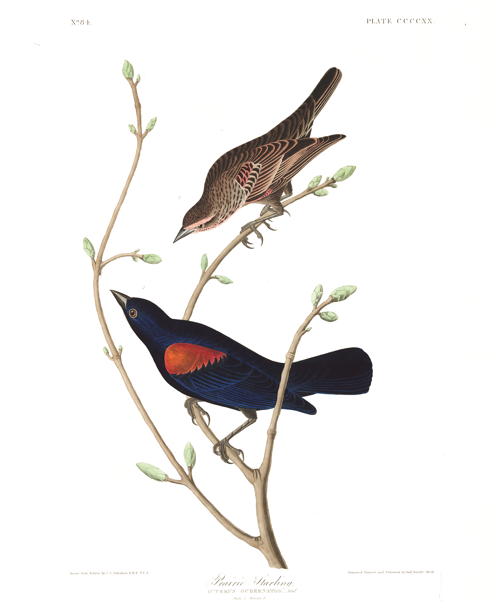

# Audubon Bird Plates

A collection of all 435 full-resolution illustrations of John James Audubon's [Birds of America](https://www.audubon.org/birds-of-america) for the purposes of education, research, and free and fair use. Courtesy of the John James Audubon Center at Mill Grove, Montgomery County Audubon Collection, and Zebra Publishing. Compiled by [Nathan Buchar](https://nathanbuchar.com). Total download size approx 2.9GB.

 

  

 

Please consult Audubon's [Terms of Use](https://www.audubon.org/terms-use) before downloading, and please credit the illustrations as follows: "Courtesy of the John James Audubon Center at Mill Grove, Montgomery County Audubon Collection, and Zebra Publishing."
